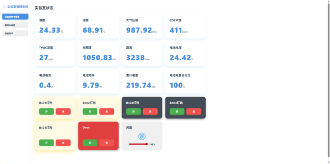
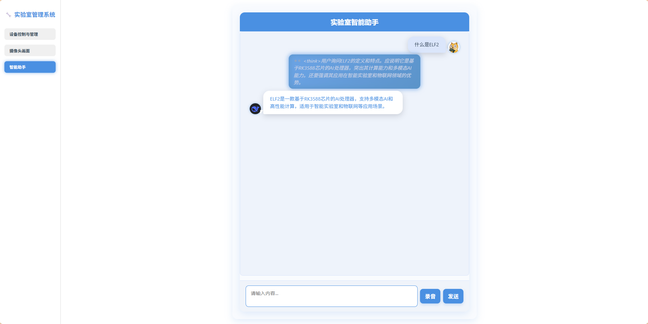

 
# 基于 ELF2 开发板的智慧实验室管理系统 

# 摘要   
针对当前高校实验室安全事故频发所暴露出的实验室智能化预警与管理短板，本项目基于  ELF2 开发板构建了一个全栈本地化部署的智慧实验室管理系统。在单一嵌入式平台集成了前端网页模块、UI 用户交互模块、AI 推理与电源网络管理四大模块。 
前端部分通过 Web 网页实现对实验室设备的远程控制、摄像头画面查看以及与本地大语言模型的对话；UI 交互界面采用轻量级 LVGL 构建，具有设备控制、电源状态查看、身份识别及元器件出入库管理等功能；AI 推理部分在本地部署了经  LoRA  微调的  Deepseek-1.5B  模型、 Whisper  语音识别模型和YOLOv8n 模型。用户可通过语音或文字输入与模型交互，获取针对实验室场景的智能应答；YOLO 模型则可用于进出人员的身份验证。电源网络模块采用 AX200 + L610 模块，实现 WiFi 与 4G 的双网络冗余保障；搭载电源管理模块，具备断电运行、实时用电检测和电量预警功能。系统通过MQTT + Flask + Frp + Nginx 实现各模块数据传输与通讯，前后端全集成于ELF2开发板，全本地化部署，无需依靠第三方API，充分保护用户隐私，运行稳定、功能完善，为高校与科研院所实验室提供高集成度一体化智慧管理解决方案。 

## 第一部分    作品概述 

### 1.1 功能与特性 
- [x] 智能控制：支持网页(电脑手机端均以适配)、UI 界面控制、智能助手控制等，
- [x] 实现对实验室灯光风扇等设备的控制。 
- [x] 环境监测：通过温湿度传感器，大气压传感器，姿态传感器，气体传感器等
- [x] 监测设备，对实验室的温湿度、二氧化碳和TVOC的浓度等环境状况进行监测，
- [x] 同时可以通过UI 界面、网页WEB界面本地或异地查看摄像头实时画面。 
- [x] 预警检测：可通过网页、UI 端实时查看用电功率、通过姿态传感器来检测
- [x] 实验室状态，发生地震时及时发出预警并执行应急自动化操作。 
- [x] 身份认证：通过摄像头采集的视频画面，用YOLOV8n模型对准入工牌进行识别，保证实验室的人员管理。 
- [x] 语音助手：可以通过web网页与实验室智能助手进行交互，支持语音输入，支持专业领域知识问答、实验室设备控制等。 
- [x] 元器件管理：可通过扫码枪和 UI 界面录入并取出元器件，便于元器件的管理。 

### 1.2 应用领域 
该智慧实验室管理系统可应用于高校及科研院所的实验室管理，特别适用于对隐私性要求较高，防止数据泄露到云端的机密级实验室、要求简单一体化部署的实验室。通过该实验室管理系统，用户可以本地或异地对实验室环境进行监测，对实验室设备进行控制，对实验室人员及设备进行管理，对实验室状态和专业化问题通过专业定制化的大语言模型得到专业的回答等等。 

### 1.3 主要技术特点 
* 全栈式本地部署：采用前端 Web、后端控制与嵌入式  UI 界面协同开发，
* 实现真正意义上的全栈部署。所有 AI 模型、网页界面、控制逻辑与交互界面均
* 在本地 ELF2开发板运行，阿里云服务器上的 FRP 和 NGINX  仅用于穿透内网、
* 提供远程访问入口，不依赖任何云端计算资源，充分发挥 RK3588 的算力优势，保障数据私密性与系统独立性。 
* 多模型协同调度：系统通过合理分配 NPU 资源实现模型协同运行，YOLO 
* 模型独占  NPU2 实现高效图像识别，Whisper  语音识别模型与大语言模型串行调度  NPU0 和 NPU1，合理分配硬件资源，在确保识别精度的同时最大化推理效率。 
* 端侧大模型的微调和部署：在RK3588上部署了经LORA微调的 Deepseek-1.5B模型，增强了其在设备控制与特定问答场景中的实用性与响应能力。 
* 双通道网络保障：采用 AX200+L610 模块,实现 4G+WIFI 的双重网络保障，
* 提升系统在复杂环境下的持续联网与远程访问能力，增强整体稳定性与可靠性。 

### 1.4 主要性能指标 
| 指标 | 性能参数 |
| :----: | :----: |
| 身份识别帧率 | 25fps |
| 大语言模型推理速度 | 4.98 tokens/s |
| Whisper 语音响应速度 | 13.28 tokens/s |
| 视频输出延迟 | ≤1s |
| 传感器数据更新速度 | ≤1s |
| NPU使用情况 | Core0:37% Core1:37% Core2:40% |
| UI 界面刷新率 | 60fps |

### 1.5 主要创新点 
* 轻量化嵌入式 UI：利用 LVGL 构建轻量化 UI，界面美观流畅。 
* 动态 LORA 加载：可依据不同的使用场景或使用人员动态加载对应的微调模型，以适配不同部署环境。 
* 元器件管理系统：解决实验室器材管理混乱的问题，可通过扫描二维码和 UI界面对器材进行管理。 
* 可扩展性：系统内置并配置完整 MQTT 通信机制，具备良好的可扩展性。

### 1.6 设计流程 
+ 需求分析：调研高校实验室管理痛点，明确需求。 
+ 系统架构设计：基于 ELF2 开发板，规划硬件模块与通信方案，支持 WiFi与4G双网络冗余。 
+ 后端开发：修改设备树复用引脚，完成引脚控制、传感器数据采集及电源管理代码开发。 
+ 前端及 UI 开发：利用LVGL开发UI 界面，HTML+CSS+JS搭建网页。 
+ 模型部署：将各模型转化成RKNN、RKLLM 形式部署到板端使用NPU加
速。 
+ 系统联调：各后端模块与UI 通过MQTT进行数据交互，前端使用Flask接口与后端通信。 
+ 测试验证：进行稳定性以及可靠性认证。 

## 第二部分    系统组成及功能说明
### 2.1 整体介绍 
本系统基于 RK3588  平台的 ELF2 开发板，采用全栈本地部署的架构，整
体由前端网页模块、后端服务模块、AI 推理模块、嵌入式 UI 模块以及电源网
络模块五大子系统构成。用户通过前端网页可实现对实验室设备的远程控制、摄
像头画面查看及与本地部署的大语言模型进行自然语言交互，前端请求由 Flask 
后端服务接收并调度至本地模型或设备接口处理。 
AI  推理模块包括  YOLOv8n、Whisper  与经  LoRA  微调的  Deepseek-1.5B 
模型，分配于  RK3588  的不同  NPU  单元中进行高效协同推理。UI  模块基于 
LVGL 构建，通过 MQTT 与后端通信，展示设备状态、电源信息、身份识别与
元器件管理界面，实现本地交互操作。系统通信采用 Flask + MQTT 架构，数据
通过 FRP+NGINX  实现公网穿透访问，而核心数据处理与模型计算全部在本地
完成，保障隐私与稳定性。整个系统各模块通过标准通信机制，协同完成智慧实
验室的感知、控制、识别与交互任务，形成一个高集成度、高适应性的本地智能
管理平台。 

 

### 2.2 硬件系统介绍 

### 2.2.1 硬件整体介绍 
本系统硬件平台以 ELF2（RK3588）嵌入式开发板为核心，具备强大的算力
和丰富的接口资源，适合部署多模型协同的本地智能系统。外围硬件模块包括：
自制电源管理 PCB 板，用于功率检测、断电续航与充电状态识别；通信模块选
用 L610，实现 4G 网络冗余连接；图像采集采用标准 USB 摄像头；二维码识
别通过扫码枪进行器材出入库管理；环境感知部分集成多种传感器：AHT20 用
于温湿度检测，BMP280 监测大气压，SGP30  实现空气质量检测（TVOC  和 CO₂ 
指标），MPU6050 用于姿态监测，BH1750  监测光照强度；执行与交互元件包括
高亮 LED  灯、扬声器用于语音播报、PWM 风扇进行温控调节，以及 SG90  舵
机用于机械动作控制。显示部分配备  7  英寸  MIPI  接口触控屏，运行基于 
LVGL 的 UI 界面，实现本地直观操作与信息展示。 

### 2.2.2 机械设计介绍 
利用CAD 画出模型平面图，考虑到走线和模型的美观度，采用双层夹板结构，将连接线走在夹层内部，使模型美观。 

 
### 2.2.3 电路各模块介绍 
* PD供电模块：采用英集芯IP6557主控为ELF2提供12v的PD协议供电。 

* 电源管理模块: 采用 INA219 对电池输出电流、电压、功率进行检测

* 设备连接部分：将ELF2上复用的IO引脚从板端上引出，分配到各个排针。 

 
### 2.3 软件系统介绍 

### 2.3.1 软件整体介绍 
本系统的软件架构围绕全栈本地化部署展开设计，涵盖前端网页、嵌入式UI界面、AI 模型推理与设备控制四大模块。前端通过 HTML+JS+CSS 构建响应式网页，支持远程控制与智能对话；嵌入式 UI 界面采用 LVGL 实现本地交互界面；AI  模块在本地部署 YOLO、Whisper 和经 LoRA  微调的 Deepseek-1.5B 模型，实现图像识别、语音转写和智能问答功能；系统通过 MQTT 与 Flask 建立统一通信机制，配合  FRP 和 Nginx 实现公网访问。整个软件系统高度集成于 ELF2 平台，模块协同运行，稳定可靠，具备良好的扩展性与隐私保障能力。 

### 2.3.2 软件各模块介绍 
* UI 模块：基于轻量级图形库 LVGL 开发，整体采用模块化设计，划分为六大功能区域：身份认证、元件库、环境监测、实验室控制、电源监测和系统信息。

* Web模块：基于 HTML、CSS 与 JavaScript  构建，在 ELF2 开发板本地通过  Python Flask  启动服务，并借助  frpc  工具将本地服务（包括  Deepseek、Whisper、MQTT 控制接口以及 MediaMTX  视频流服务）穿透至自建的阿里云服务器，实现公网访问。

* 后端模块：修改设备树（.dtsb 文件）将部分未使用的 GPIO 引脚复用为额外的 IIC 和 UART接口.所有数据采集与控制指令均通过本地部署的 MQTT 服务（监听地址为 127.0.0.1:1883）完成通信

 
## 第三部分    完成情况及性能参数 
### 3.1 整体介绍 
系统集成了网页前端、嵌入式 UI、AI 推理、网络通信及电源管理五大子模块，在一台嵌入式设备上实现了完整的软硬一体化功能部署。用户可通过网页端远程访问实验室状态、控制设备、查看摄像头画面，或通过本地 UI 实现身份识别、环境监测、元器件出入库等操作。AI 推理模块则支持 YOLOv8n 目标检测、Whisper 语音识别及  LoRA 微调的 Deepseek-1.5B 大语言模型，支持语音对话与智能问答服务。系统使用  AX200 与 L610 实现  WiFi 与 4G 的双通道冗余通信，并搭配自研电源管理板实现断电续航、电流检测与功耗预警。各模块通过 MQTT、Flask、Frp  与  Nginx  组成轻量化本地通信网络，前后端统一部署在 ELF2 板上，完全脱离云端依赖，确保数据私密与系统自治，为智慧实验室提供高集成度、安全性与扩展性的整体解决方案。 
 
 

 

### 3.2  工程成果 
### 3.2.1 电路成果 
 
 

### 3.2.3 软件成果  
 * Web界面

 

 

* LVGL界面 

### 3.3 特性成果 
1. 身份认证：在环境光较好的情况下可在1-2s内完成识别。 
2. 传感器数据：各传感器更新速度为1s/次，确保数据更新的实时性。 
3. 设备控制：设备控制延迟小于等于2s，用户几乎感受不到操作延迟。 
4. AI 交流：采用LORA微调的大语言模型，扩展其特定知识的能力，方便给用户更专业的回答
5. 摄像头画面：延迟在1s 以内，确保实时检测实验室状态。 

## 第四部分    总结
### 4.1  可扩展之处 
- [ ] 模型扩展：大语言模型可动态加载多个LORA，以适应不同的使用人群，给予准确专业的回答； 
- [ ] 身份验证：可扩展 FaceNet，用 YOLO 划定人脸后用 FaceNet 来提取特征向量实现人脸识别 
- [ ] 设备扩展：已搭建好MQTT服务器，可自行添加MQTT设备进行扩展 
- [ ] 异常预警：可加上姿态识别或行为监测，对实验室的危险行为进行体系进一步确保安全 

